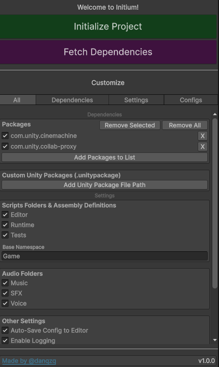

# Initium — Unity Ecosystem Bootstrap 🚀

**Initium** is a Unity package that kickstarts your project with a curated, ready-to-use ecosystem of tools, structure, and best practices — so you can focus on creating, not configuring.



## ✨ Features

| Feature                    | Description                                                   |
|----------------------------|---------------------------------------------------------------|
| 📂 Structured Folder Setup | Pre-organized folders for scripts, packages, and more.        |
| ⚙️ Essential Tools         | Commonly used packages pre-installed and configured.          |
| 🧩 Modular Design          | Add or remove features as needed without breaking the project. |
| 🛠️ Configuration          | Import/export or save your configuration into the editor.     |
| 🚀 Quick Start             | Start developing immediately with a functional setup.         |

## 📦 Installation via Unity Git URL

1. Open Unity and go to **Window → Package Manager**.
2. Click the **+** icon → **Add package from Git URL**.
3. Paste the repository URL:

   ```
   https://github.com/danqzq/unity-initium.git
   ```
4. Click **Add** — Unity will fetch and install Initium automatically.

## 🚧 Roadmap

| Feature                                                                        | Status |
|--------------------------------------------------------------------------------|--------|
| Customizable `Audio` folders and `AudioMixer` setup with exposed volume parameters                               | ✅ Done |
| Extra configurations for graphics, publishing, etc based on targeted platforms | 🛠️ Planned |
| Folder coloring in Project window                                              | 🛠️ Planned |
| Advanced theming (light/dark presets, custom color palettes)                   | 🛠️ Planned |
| Quick-actions panel for common editor tasks                                    | 🛠️ Planned |
| Game jam mode (provides an optimized structure and setup for game jams)        | 🛠️ Planned |

## 📜 License

[MIT License](LICENSE) — free to use and modify.
